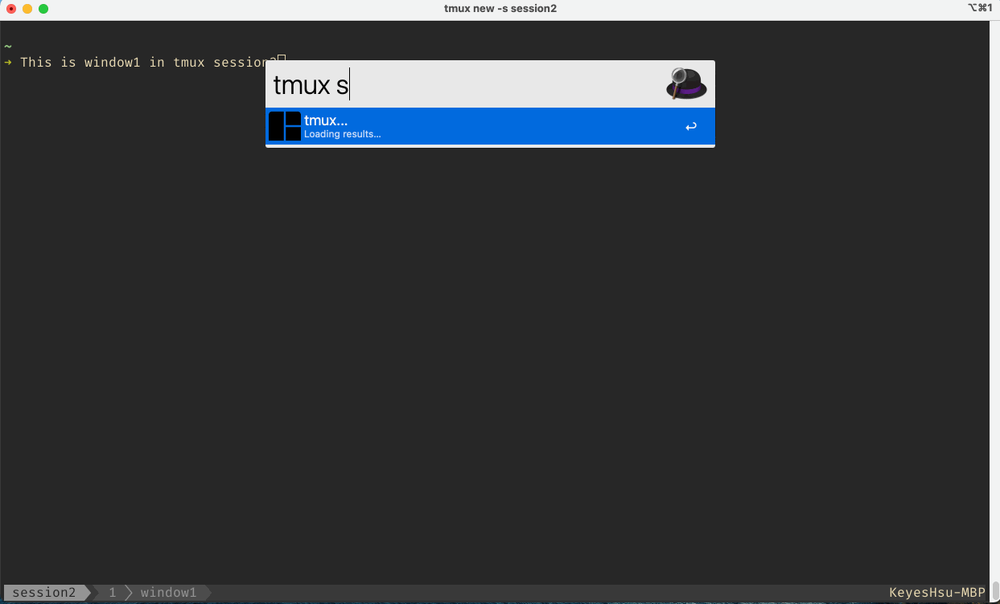

<h1 align="center">Welcome to alfred-tmux-workflow 👋</h1>
<p>
  
  
  <a href="https://github.com/KeyesHsu/alfred-tmux-workflow/blob/main/LICENSE" target="_blank">
    
  </a>
</p>

Search tmux sessions/windows and open in iTerm2.


##### Resources:
* [Changelog](CHANGELOG.md)

## Setup
This workflow requires python3, and [libtmux](https://github.com/tmux-python/libtmux).  
You can install [libtmux](https://github.com/tmux-python/libtmux) via pip (`pip install libtmux`)

## Workflow Variables
- `pythonw`: Python with libtmux installed, for example `/usr/local/bin/python3`

## Commands
Search tmux sessions and windows.
```sh
tmux
```
Search sessions only.
```sh
tmux s
```
Search windows only.
```sh
tmux w
```
Use `Enter` to open entry in iTerm2

## Author

👤 **Keyes Hsu**

* Github: [@KeyesHsu](https://github.com/KeyesHsu)

## 🤝 Contributing

Contributions, issues and feature requests are welcome!<br />Feel free to check [issues page](https://github.com/KeyesHsu/alfred-tmux-workflow/issues). 

## Show your support

Give a ⭐️ if this project helped you!

## 📝 License

Copyright © 2022 [Keyes Hsu](https://github.com/KeyesHsu).<br />
This project is [MIT](https://github.com/KeyesHsu/alfred-tmux-workflow/blob/main/LICENSE) licensed.

***
_This README was generated with ❤️ by [readme-md-generator](https://github.com/kefranabg/readme-md-generator)_
